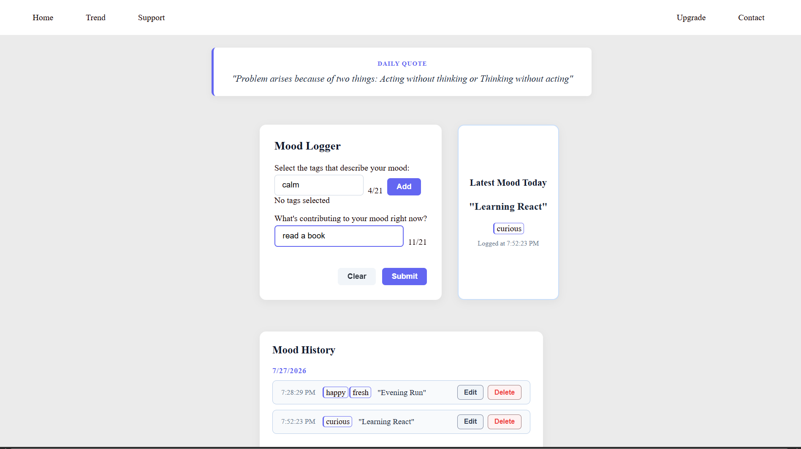

# Mood Logger

A React application for logging your daily mood with tags and notes. This project was built to gain hands-on experience with React and strengthen my understanding of component-based UI development, state management, and form handling.

## Live Demo

🌐 https://mood-logger-react.vercel.app

## Screenshots




## Features

### Mood Logger
- Record your current mood.
- Add multiple tags with autocomplete suggestions. 
- Allows user to add custom tags .
- Write notes about what influenced your mood.
- Live character counter for notes.
- Clear and submit actions.

### Latest Mood
- Displays the most recent mood entry.
- Shows associated tags and timestamp.

### Mood History
- Entries grouped by date.
- Edit existing entries.
- Delete entries with confirmation.

### Other
- Daily motivational quote on the home page.
- Navigation prepared for future sections:
  - Home
  - Trends
  - Support
  - Upgrade
  - Contact

> **Current Status:** Only the Home page is fully functional. The remaining sections are planned for future development.

---

## Tech Stack

- React
- Vite
- JavaScript (ES6+)
- CSS3

---

## Project Structure

```text
MoodLogger-React/
├── public/
├── src/
│   ├── assets/
│   ├── App.css
│   ├── App.jsx
│   └── main.jsx
├── index.html
├── package.json
├── vite.config.js
├── eslint.config.js
└── README.md
```

---

## Getting Started

```bash
git clone https://github.com/Codeka24-7/MoodLogger-React.git

cd MoodLogger-React

npm install

npm run dev
```

---

## Data Storage

Currently, all mood entries are stored only in React state.

Refreshing the page clears the data because persistent storage has not yet been implemented.

---

## Roadmap

- [ ] Persist data using a database
- [ ] Search and filter mood entries
- [ ] Mood trends and visualisations
- [ ] Complete the Trends, Support, Upgrade and Contact pages
- [ ] Responsive design improvements

---

## Learning Outcomes

This project helped me practise:

- React components
- Props
- State management with `useState`
- Controlled form inputs
- Conditional rendering
- Rendering lists
- Component composition
- Basic React project organisation


---

## License

This project is licensed under the MIT License.
